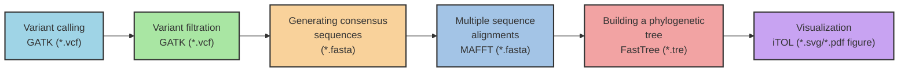

# Building a Phylogenetic Tree

In the previous step, we identified single nucleotide polymorphisms (SNPs) using the Genome Analysis Toolkit (`GATK`). To prepare this data for phylogenetic analysis, we utilized a customized Python script available from the [Broad Institute's GitHub](https://github.com/broadinstitute/broad-fungalgroup/blob/master/scripts/SNPs/vcfSnpsToFasta.py). This script extracts all the SNPs for each sample and concatenates them with the corresponding reference alleles at those positions, resulting in a multi-FASTA file. With the multi-FASTA file generated, we can proceed to construct a phylogenetic tree.

Phylogenetic trees are invaluable tools in evolutionary biology, allowing researchers to trace the lineage of organisms, understand the genetic divergence between species, and infer ancestral relationships. In our specific case, analyzing the SNPs will enable us to uncover the evolutionary pathways and genetic variations within the fungal isolates, shedding light on their adaptation mechanisms and evolutionary dynamics.

To construct the phylogenetic tree, we will use `FastTree`, a computationally efficient program known for its speed and accuracy in building large-scale phylogenies. `FastTree` **approximately-maximum-likelihood phylogenetic trees from alignments of nucleotide or protein sequences and can handle alignments with up to a million sequences in a reasonable amount of time and memory**. For large alignments, `FastTree` is 100-1,000 times faster than PhyML 3.0 or RAxML 7. As open-source software, `FastTree` is freely available for download and use.

This tutorial draws inspiration from [Dr. Jennifer Chang's Bioinformatics Workbook](https://bioinformaticsworkbook.org/phylogenetics/FastTree.html#gsc.tab=0).

## Software required
[MAFFT](https://mafft.cbrc.jp/alignment/software/): For aligning sequences.
[FastTree](http://meta.microbesonline.org/fasttree/#Usage): Build phylogenetic trees quickly.
[iTOL](https://itol.embl.de/): View phylogenetic trees.

## Overview of the pipeline


## Example Dataset

Candida auris (C. auris) is a yeast that poses significant challenges in healthcare due to its antifungal resistance and potential to cause life-threatening infections. It primarily affects ill or immunocompromised patients and spreads easily in hospitals, often colonizing without symptoms. Accurate identification requires specialized tests like sequencing or mass spectrometry. Clinical infections, which have nonspecific symptoms, should be treated with echinocandins as the first-line therapy in adults, and consulting an infectious disease specialist is recommended. Early detection, screening, and strict infection control measures are crucial to prevent its spread.

- Reference sequence [GCA_016772135.1](https://www.ncbi.nlm.nih.gov/datasets/genome/GCA_016772135.1/), B11205 (Clade I, South Asian clade), is widely used for SNP analysis of Candida auris.

- 5 Candida auris sequences ([SRR10461159 Canada](https://www.ncbi.nlm.nih.gov/sra/?term=SRR10461159), [SRR3883438 Pakistan](https://www.ncbi.nlm.nih.gov/sra/?term=SRR3883438), [SRR3883441 India](https://www.ncbi.nlm.nih.gov/sra/?term=SRR3883441), [SRR3883463 South Africa](https://www.ncbi.nlm.nih.gov/sra/?term=SRR3883463), [SRR9007776 Iran](https://www.ncbi.nlm.nih.gov/sra/?term=SRR9007776)) were obtained via whole-genome sequencing with paired-end reads.

- Following upstream analysis, all sequences undergo variant calling to identify Single Nucleotide Polymorphisms (SNPs). The resulting Variant Call Format (`VCF`) files are then converted into `FASTA` format and subsequently merged into a single, composite `FASTA` file named `input_aln.fasta`. :heavy_exclamation_mark:**The `FASTA` sequences have undergone multiple sequence alignment.**


```bash
$ grep ">" input_aln.fasta
>reference
>Canada
>India
>Iran
>Pakistan
>SouthAfrica
```
## Steps

### Step 1: `MAFFT`

`FastTree` requires an input file formatted as a multiple sequence alignment (MSA) in `FASTA` format. If your file isn't already an MSA, use the tools `MAFFT`. For this task, my file is already formatted as an MSA.

For nucleotide alignment using `MAFFT`, employ the `--auto` option to automatically detect parameters and generate the aligned sequence file `input_aln.fasta`.

```bash
$ mafft --auto vcf-to-fasta.fasta > input_aln.fasta
```
### Step 2: `FastTree`

```bash
# For a nucleotide alignment
$ fasttree -nt -gtr -gamma input_aln.fasta > fasttree_phylogeny.tre

# For a protein alignment
$ fasttree input_aln.fasta > fasttree_phylogeny.tre
```

For nucleotide alignment, utilize `FastTree` with the `-nt` `-gtr` `-gamma` options on the aligned sequence file `input_aln.fasta` to generate the phylogenetic tree file `output_phylogeny.tre`.

```bash
$ fasttree -gtr -gamma -fastest -log fasttree_phylogeny.tre.log -nt input_aln.fasta > fasttree_phylogeny.tre
```

The resulting `output_phylogeny.tre` file will display the organisms grouped in Newick format, similar to:
```
(reference:0.000074614,Pakistan:0.000064449,(India:0.000210264,(SouthAfrica:0.086664658,(Iran:3.585887617,Canada:0.192768854)0.932:0.000000006)1.000:0.090328955)0.997:0.000098466);
```

### Step 3: `iTOL`

Upload your tree file to https://itol.embl.de/: iTOL supports formats like Newick, Nexus, PhyloXML, and Jplace. Upload anonymously or by creating an account.

Explore the interface and visualization functions: Customize your tree's appearance with various layouts (circular, rectangular), branch lengths, colors, and label fonts and sizes. 

Export your tree: Once satisfied, export your tree as a high-quality image file (`SVG`, `PDF`) for presentations or publications.


               
## References
Fast Tree Documentation: http://meta.microbesonline.org/fasttree/#Usage

Phylogenetics - Back to basics: https://training.galaxyproject.org/topics/evolution/tutorials/abc_intro_phylo/tutorial.html

Phylogenetic analysis for beginners using MEGA 11 software: https://www.youtube.com/watch?v=u9YNvHaRI5A

Phylogenetic Tree Construction with iTol: https://www.youtube.com/watch?v=orLVMEZMp0Y
