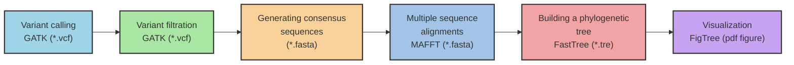

# Building a Phylogenetic Tree

In the previous step, we identified single nucleotide polymorphisms (SNPs) using the Genome Analysis Toolkit (GATK). To prepare this data for phylogenetic analysis, we utilized a customized Python script available from the [Broad Institute's GitHub](https://github.com/broadinstitute/broad-fungalgroup/blob/master/scripts/SNPs/vcfSnpsToFasta.py). This script extracts all the SNPs for each sample and concatenates them with the corresponding reference alleles at those positions, resulting in a multi-FASTA file. With the multi-FASTA file generated, we can proceed to construct a phylogenetic tree.

Phylogenetic trees are invaluable tools in evolutionary biology, allowing researchers to trace the lineage of organisms, understand the genetic divergence between species, and infer ancestral relationships. In our specific case, analyzing the SNPs will enable us to uncover the evolutionary pathways and genetic variations within the fungal isolates, shedding light on their adaptation mechanisms and evolutionary dynamics.

To construct the phylogenetic tree, we will use `FastTree`, a computationally efficient program known for its speed and accuracy in building large-scale phylogenies. `FastTree` **approximately-maximum-likelihood phylogenetic trees from alignments of nucleotide or protein sequences and can handle alignments with up to a million sequences in a reasonable amount of time and memory**. For large alignments, `FastTree` is 100-1,000 times faster than PhyML 3.0 or RAxML 7. As open-source software, FastTree is freely available for download and use.

This tutorial draws inspiration from [Dr. Jennifer Chang's Bioinformatics Workbook](https://bioinformaticsworkbook.org/phylogenetics/FastTree.html#gsc.tab=0).

## Software required
[MAFFT](https://mafft.cbrc.jp/alignment/software/): For aligning sequences.
[FastTree](http://meta.microbesonline.org/fasttree/#Usage): Build phylogenetic trees quickly.
[FigTree](http://tree.bio.ed.ac.uk/software/figtree/): View phylogenetic trees.

## Overview of the pipeline


## Example Dataset
- Reference sequence [GCA_016772135.1](https://www.ncbi.nlm.nih.gov/datasets/genome/GCA_016772135.1/), B11205 (Clade I, South Asian clade), is widely used for SNP analysis of Candida auris.

- 5 Candida auris sequences ([SRR27718832](https://www.ncbi.nlm.nih.gov/sra/SRR27718832), [SRR27718834](https://www.ncbi.nlm.nih.gov/sra/?term=SRR27718834), [SRR28872828](https://www.ncbi.nlm.nih.gov/sra/?term=SRR28872828), [SRR28872841](https://www.ncbi.nlm.nih.gov/sra/?term=SRR28872841), [SRR28872842](https://www.ncbi.nlm.nih.gov/sra/?term=SRR28872842)) were obtained via whole-genome sequencing with paired-end reads.

- Following upstream analysis, all sequences undergo variant calling to identify Single Nucleotide Polymorphisms (SNPs). The resulting Variant Call Format (`VCF`) files are then converted into FASTA format and subsequently merged into a single, composite `FASTA` file named `vcf-to-fasta.fasta`.

```bash
$ grep ">" vcf-to-fasta.fasta
>reference
>SRR27718832
>SRR27718834
>SRR28872828
>SRR28872841
>SRR28872842
```
## Steps

### Step 1: `MAFFT`

For nucleotide alignment using `MAFFT`, employ the `--auto` option to automatically detect parameters and generate the aligned sequence file input_aln.fasta.

```bash
mafft --auto vcf-to-fasta.fasta > input_aln.fasta
```
### Step 2: FastTree

```bash
# For a nucleotide alignment
FastTree -nt -gtr -gamma input_aln.fasta > output.tre

# For a protein alignment
FastTree input_aln.fasta > output.tre
```

For nucleotide alignment, utilize `FastTree` with the `-nt` `-gtr` `-gamma` options on the aligned sequence file `input_aln.fasta` to generate the phylogenetic tree file `output_phylogeny.tre`.

```bash
fasttree -gtr -gamma -fastest -log output_phylogeny.tre.log -nt input_aln.fasta > output_phylogeny.tre
```

The resulting `output_phylogeny.tre` file will display the organisms grouped in Newick format, similar to:
```
(SRR27718832:0.000030713,SRR27718834:0.000017589,(reference:0.000252831,(SRR28872828:0.330423874,(SRR28872841:0.000124734,SRR28872842:0.000052112)1.000:4.264691578)0.998:0.015471241)1.000:0.000517116);
```

### Step 3: FigTree

Open FigTree and load your `output_phylogeny.tre` file using `File > Open Tree`. Since the tree is unrooted, set the midpoint `(Ctrl-M)` and sort upward `(Ctrl-U)` as a starting root estimate. Adjust the root position based on virus studies or chronological data, positioning it close to the earliest viral sequence if applicable.

#### Basic Tree Visualization:
Experiment with FigTree's visualization tools. Explore expandable sections on the left, use the Node/Clade/Taxa buttons, and apply branch coloring through the "Colour" menu.

#### Annotated Tree:
After customization, save the tree. The input.tre file converts to NEXUS format, retaining the original Newick tree in the "begin trees;" section.

This structured workflow guides you through sequence alignment with MAFFT, phylogenetic tree construction using FastTree, and visualization in FigTree, facilitating comprehensive analysis and visualization of evolutionary relationships. Adjust commands and options based on specific dataset requirements and analytical goals.


                 
## References
Fast Tree Documentation: http://meta.microbesonline.org/fasttree/#Usage

Phylogenetics - Back to basics: https://training.galaxyproject.org/topics/evolution/tutorials/abc_intro_phylo/tutorial.html
