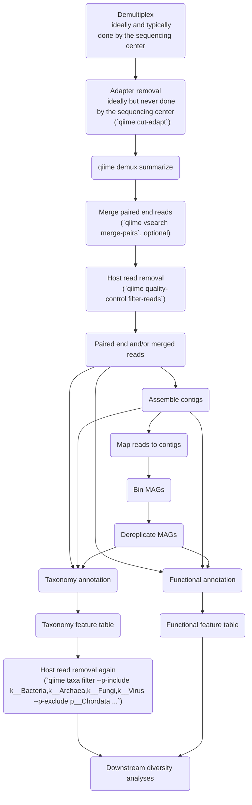

# Diagram of QIIME 2 metagenomics workflow

```mermaid
flowchart TD;
    a("Demultiplex
       ideally and typically done by the sequencing center");
    b("Adapter removal
       ideally but never done by the sequencing center
       (`qiime cut-adapt`)");
    a-->b;
    b-->c("`qiime demux summarize`");
    c-->d("Merge paired end reads
          (`qiime vsearch merge-pairs`, optional)");
    d-->e("Host read removal
          (`qiime quality-control filter-reads`)");
    e-->f("Paired end and/or merged reads");
    f-->g("Assemble contigs");
    g-->h("Map reads to contigs");
    h-->i("Bin MAGs");
    i-->n("Dereplicate MAGs");
    f-->j("Taxonomy annotation");
    j-->k("Taxonomy feature table");
    k-->o("Host read removal again
          (`qiime taxa filter --p-include k__Bacteria,k__Archaea,k__Fungi,k__Virus --p-exclude p__Chordata ...`)")
    o-->p("Downstream diversity analyses");
    f-->l("Functional annotation");
    l-->m("Functional feature table");
    m-->p;
    g-->j;
    g-->l;
    n-->j;
    n-->l;
```
