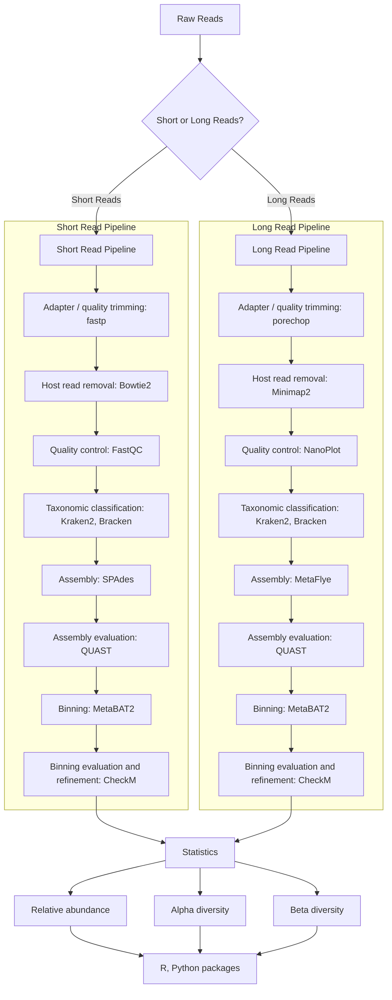

# SHOTGUN METAGENOMICS WORKFLOW USING OXFORD NANOPORE PLATFORM



## 1. Set Up

### 1.1. Install Miniforge

Download and install `Miniforge` (a minimal conda installer):

```bash
wget --no-check-certificate https://github.com/conda-forge/miniforge/releases/latest/download/Miniforge3-Linux-x86_64.sh
bash Miniforge3-Linux-x86_64.sh
conda init
source ~/.bashrc
```

### 1.2. Create and Activate the Environment

Create and activate the environment using `mamba`:

```bash
mamba create --name shotgun
mamba activate shotgun
```

### 1.3. Install Additional Software

Install the necessary tools for shotgun metagenomics:

```bash
# Create a new environment named bio-env
mamba create --name long_read_shotgun -y

# Activate the environment
source activate long_read_shotgun

# Install packages from Bioconda
mamba install -c bioconda sra-tools
mamba install -c bioconda fastp porechop bowtie2 samtools minimap2 fastqc nanoplot quast spades flye pandas kraken2 bracken
```

Set up the environment for binning.

```bash
mamba create --name binning python=2.7.15 \
    metawrap \
    biopython=1.68 \
    blast=2.6.0 \
    bmtagger=3.101 \
    bowtie2=2.3.5 \
    bwa=0.7.17 \
    checkm-genome=1.0.12 \
    fastqc=0.11.8 \
    kraken=1.1 \
    kraken2=2.0 \
    krona=2.7 \
    matplotlib-base=2.2.3 \
    maxbin2=2.2.6 \
    metabat2=2.12.1 \
    pandas=0.24.2 \
    perl-bioperl \
    pplacer=1.1.alpha19 \
    prokka=1 \
    quast=5.0.2 \
    r-ggplot2=3.1.0 \
    r-reshape2 \
    r-recommended=3.5.1 \
    samtools=1.9 \
    seaborn=0.9.0 \
    spades=3.13.0 \
    trim-galore=0.5.0
```

Set up the environment for checkm.

```bash
# Create and activate the conda environment
mamba create -n checkm2 python=3.8 -y
mamba activate checkm2

# Install CheckM2
mamba install -c bioconda checkm2 -y

# Create directory for CheckM2 database
mkdir -p checkm2_db
cd checkm2_db

# Download the CheckM2 database
checkm2 database --download --path .

# Set the CHECKM2DB environment variable
export CHECKM2DB="path/to/checkm2_db"
```

### 1.4. Download Additional Kraken Tools

Download the additional tools for Kraken2 analysis (such as `kreport2mpa.py` and `combine_mpa.py`):

```bash
wget https://raw.githubusercontent.com/jenniferlu717/KrakenTools/master/kreport2mpa.py
wget https://raw.githubusercontent.com/jenniferlu717/KrakenTools/master/combine_mpa.py
```

Make these Python scripts executable:

```bash
chmod +x kreport2mpa.py combine_mpa.py
```

## 2. Download Raw Data

Create a metadata file (`meta_data.txt`) with each field separated by a tab delimiter:

```bash
nano meta_data.txt
```

Add the following content to `metadata_short.txt`:

```
SRR18491279   CD_7_short
SRR18491059   TD_31_short
SRR18491219   TD_92_short
```

Add the following content to `metadata_long.txt`:

```
SRR18491202   CD_7_long
SRR18490949   TD_31_long
SRR18491134   TD_92_long
```

Create directories for raw data:

```bash
mkdir raw_data_short
mkdir raw_data_long
```

Download the raw data:

```bash
# Activate the environment
source activate long_read_shotgun

fastq-dump --split-files --gzip SRR18491219 SRR18491059 SRR18491279 -O raw_data_short
fastq-dump --gzip SRR18491134 SRR18490949 SRR18491202 -O raw_data_long
```

## 3. Download Database

### 3.1 Host Fasta

Download the host genome sequence:

```bash
wget https://hgdownload.soe.ucsc.edu/goldenPath/hg38/bigZips/latest/hg38.fa.gz
gunzip hg38.fa.gz
```

Create a directory for the host index and build the Bowtie2 index:

```bash
# Activate the environment
source activate long_read_shotgun

mkdir host_index
cd host_index
bowtie2-build --threads 10 ../hg38.fa "bt2_index_base"
```

### 3.2 Taxonomic Classification

Download the Kraken2 database:

```bash
wget https://genome-idx.s3.amazonaws.com/kraken/k2_minusb_20240605.tar.gz
tar -xzvf k2_minusb_20240605.tar.gz k2_mini_db
```

## 4. Pipeline

### 4.1 Quality Control 

#### For Short Reads

For each sample in the `raw_data_short` directory, perform adapter trimming, quality filtering, alignment, and quality assessment.

```bash
# Activate the environment
source activate long_read_shotgun

# Loop through raw short read samples in the raw_data_short directory
for sample in raw_data_short/*; do
    # Get the base name of the sample (e.g., sample1 from raw_data_short/sample1)
    SAMPLE_NAME=$(basename "$sample")

    # Create directories for trimmed data, host removal, and FastQC results
    mkdir -p "${SAMPLE_NAME}/trimmed"
    mkdir -p "${SAMPLE_NAME}/remove_host"
    mkdir -p "${SAMPLE_NAME}/fastqc"

    # Run fastp for quality control
    fastp \
        --in1 "raw_data_short/${SAMPLE_NAME}_1.fastq.gz" \
        --in2 "raw_data_short/${SAMPLE_NAME}_2.fastq.gz" \
        --out1 "${SAMPLE_NAME}/trimmed/${SAMPLE_NAME}_1.fastp.fastq.gz" \
        --out2 "${SAMPLE_NAME}/trimmed/${SAMPLE_NAME}_2.fastp.fastq.gz" \
        --json "${SAMPLE_NAME}/trimmed/${SAMPLE_NAME}_fastp.fastp.json" \
        --html "${SAMPLE_NAME}/trimmed/${SAMPLE_NAME}_fastp.fastp.html" \
        --thread 6 \
        --detect_adapter_for_pe \
        -q 15 --cut_front --cut_tail --cut_mean_quality 15 --length_required 15 \
        2> "${SAMPLE_NAME}/trimmed/${SAMPLE_NAME}_fastp.fastp.log"

    # Run Bowtie2 for host removal alignment
    bowtie2 -p 10 \
        -x host_index/bt2_index_base \
        -1 "${SAMPLE_NAME}/trimmed/${SAMPLE_NAME}_1.fastp.fastq.gz" \
        -2 "${SAMPLE_NAME}/trimmed/${SAMPLE_NAME}_2.fastp.fastq.gz" \
        --sensitive \
        --un-conc-gz "${SAMPLE_NAME}/remove_host/${SAMPLE_NAME}_host_removed.unmapped_%.fastq.gz" \
        --al-conc-gz "${SAMPLE_NAME}/remove_host/${SAMPLE_NAME}_host_removed.mapped_%.fastq.gz" \
        1> /dev/null \
        2> "${SAMPLE_NAME}/remove_host/${SAMPLE_NAME}_host_removed.bowtie2.log"

    # Remove temporary mapped fastq files
    rm -f "${SAMPLE_NAME}/remove_host/${SAMPLE_NAME}_host_removed.mapped_*.fastq.gz"

    # Run FastQC for quality assessment on unmapped reads
    fastqc \
        --quiet \
        --threads 6 \
        --memory 10000 \
        -o "${SAMPLE_NAME}/fastqc" \
        "${SAMPLE_NAME}/remove_host/${SAMPLE_NAME}_host_removed.unmapped_1.fastq.gz" \
        "${SAMPLE_NAME}/remove_host/${SAMPLE_NAME}_host_removed.unmapped_2.fastq.gz"
done
```

#### For Long Reads

For each sample in the `raw_data_long` directory, perform adapter trimming and host removal:

```bash
# Activate the environment
source activate long_read_shotgun

# Set the reference genome path
reference_genome="hg38.fa.gz"

# Read the metadata file
while read -r SRR SAMPLE_NAME; do
    # Define the sample path using the sample's SRR ID
    sample="raw_data_long/${SRR}.fastq.gz"

    # Check if sample exists
    if [[ ! -f "$sample" ]]; then
        echo "Sample not found: $sample"
        continue
    fi

    # Create directories for trimmed data, host removal, and FastQC results
    mkdir -p "${SAMPLE_NAME}/trimmed"
    mkdir -p "${SAMPLE_NAME}/remove_host"
    mkdir -p "${SAMPLE_NAME}/qc"

    # Adapter trimming for Oxford Nanopore reads
    porechop -i "$sample" -t 4 -o "${SAMPLE_NAME}/trimmed/${SAMPLE_NAME}.porechop.fastq"
    if [[ $? -ne 0 ]]; then
        echo "Error during porechop for sample ${SAMPLE_NAME}"
        continue
    fi

    # Align with Minimap2 and sort
    minimap2 -t 4 --cap-kalloc 100m --cap-sw-mem 50m -ax map-ont -m 50 --secondary=no "$reference_genome" \
        "${SAMPLE_NAME}/trimmed/${SAMPLE_NAME}.porechop.fastq" | samtools sort -@ 3 -o "${SAMPLE_NAME}/${SAMPLE_NAME}.sorted.bam"
    if [[ $? -ne 0 ]]; then
        echo "Error during minimap2 alignment for sample ${SAMPLE_NAME}"
        continue
    fi

    # Get unmapped reads & convert sorted BAM to unmapped BAM
    samtools view -@ 3 -b -f 4 \
        -o "${SAMPLE_NAME}/${SAMPLE_NAME}.unmapped.bam" \
        "${SAMPLE_NAME}/${SAMPLE_NAME}.sorted.bam"

    # Convert unmapped BAM to FASTQ format and compress it
    samtools fastq -@ 3 -T '*' "${SAMPLE_NAME}/${SAMPLE_NAME}.unmapped.bam" | bgzip -@ 4 > "${SAMPLE_NAME}/remove_host/${SAMPLE_NAME}.unmapped.fastq.gz"

    # Optionally remove the sorted BAM and unmapped BAM files if not needed
    rm "${SAMPLE_NAME}/${SAMPLE_NAME}.sorted.bam" "${SAMPLE_NAME}/${SAMPLE_NAME}.unmapped.bam"

    # Run quality control
    NanoPlot -t 1 -p filtered -c darkblue --title "${SAMPLE_NAME}" --fastq "${SAMPLE_NAME}/remove_host/${SAMPLE_NAME}.unmapped.fastq.gz"
    
done < metadata_long.txt

```

### 4.2 Taxonomic Classification of Reads from Short Read and Long Read

```bash

# Activate the environment
source activate long_read_shotgun

# Path to Kraken2 database
KRAKEN2_DB='k2_mini_db'

# Loop through all the long-read samples for paired-end files
while read -r SRR SAMPLE_NAME; do
    # Create the directory for the Kraken2 results
    OUTPUT_DIR="${SAMPLE_NAME}/kraken2"
    mkdir -p "$OUTPUT_DIR"

    # Set READ1 to the first paired-end file
    READ1=$(ls "${SAMPLE_NAME}/remove_host/"*_1.fastq.gz 2>/dev/null)

    # Check if READ1 file exists
    if [ -z "$READ1" ]; then
        echo "Error: No *_1.fastq.gz file found in ${SAMPLE_NAME}/remove_host/"
        continue
    fi

    # Get the corresponding READ2 file by replacing _1 with _2 in the filename
    READ2="${READ1/_1.fastq.gz/_2.fastq.gz}"

    # Check if READ2 file exists
    if [ ! -f "$READ2" ]; then
        echo "Error: $READ2 not found!"
        continue
    fi

    # Define output file paths
    OUTPUT_KRAKEN2_FILE="${OUTPUT_DIR}/${SAMPLE_NAME}.kraken2"
    REPORT_KRAKEN2_FILE="${OUTPUT_DIR}/${SAMPLE_NAME}.kraken2.report.txt"
    REPORT_MPA_FILE="${OUTPUT_DIR}/${SAMPLE_NAME}.kraken2.mpa"

    # Run Kraken2 with specified options
    kraken2 --db "$KRAKEN2_DB" \
        --output "$OUTPUT_KRAKEN2_FILE" \
        --confidence 0.03 \
        --report "$REPORT_KRAKEN2_FILE" \
        --memory-mapping \
        --paired "$READ1" "$READ2"

    # Convert Kraken2 report to Metaphlan format using a custom script (kreport2mpa.py)
    python kreport2mpa.py -r "$REPORT_KRAKEN2_FILE" --display-header -o "$REPORT_MPA_FILE"
    
    # Run Bracken to generate a more accurate abundance report
    for LEVEL in P C O F G S S1; do
        bracken \
            -d "$KRAKEN2_DB" \
            -i "$REPORT_KRAKEN2_FILE" \
            -o "${OUTPUT_DIR}/${SAMPLE_NAME}.bracken_${LEVEL}.txt" \
            -r 150 \
            -l "$LEVEL"
    done    

done < metadata_short.txt

# Loop through all the long-read samples for unmapped files
while read -r SRR SAMPLE_NAME; do
    # Create the directory for the Kraken2 results
    OUTPUT_DIR="${SAMPLE_NAME}/kraken2"
    mkdir -p "$OUTPUT_DIR"

    # Path to the unmapped FASTQ file
    FA_FILE="${SAMPLE_NAME}/remove_host/${SAMPLE_NAME}.unmapped.fastq.gz"

    # Define output file paths
    OUTPUT_KRAKEN2_FILE="${OUTPUT_DIR}/${SAMPLE_NAME}.kraken2"
    REPORT_KRAKEN2_FILE="${OUTPUT_DIR}/${SAMPLE_NAME}.kraken2.report.txt"
    REPORT_MPA_FILE="${OUTPUT_DIR}/${SAMPLE_NAME}.kraken2.mpa"

    # Run Kraken2 with specified options
    kraken2 --db "$KRAKEN2_DB" \
        --output "$OUTPUT_KRAKEN2_FILE" \
        --confidence 0.03 \
        --report "$REPORT_KRAKEN2_FILE" \
        --memory-mapping \
        --gzip-compressed "$FA_FILE"
    
    # Convert Kraken2 report to Metaphlan format using a custom script (kreport2mpa.py)
    python kreport2mpa.py -r "$REPORT_KRAKEN2_FILE" --display-header -o "$REPORT_MPA_FILE"

    # Run Bracken to generate a more accurate abundance report
    for LEVEL in P C O F G S S1; do
        bracken \
            -d "$KRAKEN2_DB" \
            -i "$REPORT_KRAKEN2_FILE" \
            -o "${OUTPUT_DIR}/${SAMPLE_NAME}.bracken_${LEVEL}.txt" \
            -r 300 \
            -l "$LEVEL"
    done    
done < metadata_long.txt

# Define taxonomic levels for combining Bracken outputs
for LEVEL in P C O F G S S1; do
    combine_bracken_outputs.py \
        --files ./*/*/*.bracken_${LEVEL}.txt \
        --output long_short.reads.bracken_${LEVEL}.txt
done

# Create a directory to store feature counts files (MPA format) if it doesn't exist
MPA_DIR="taxonomy_mpa"
mkdir -p "$MPA_DIR"

# Find and copy all .mpa files to the taxonomy_mpa directory
find . -type f -name "*.mpa" -exec cp {} "$MPA_DIR" \;

# Check if MPA files exist before attempting to combine them
if ls "$MPA_DIR"/*.mpa 1> /dev/null 2>&1; then
    # Combine MPA files into summary
    python combine_mpa.py -i taxonomy_mpa/*.kraken2.mpa --output long_short.reads.kraken.txt
else
    echo "No .mpa files found in $MPA_DIR. Skipping combination step."
fi

# Remove the MPA_DIR after processing
rm -rf "$MPA_DIR"
```

### 4.3 Assembly

#### For Short Reads

```bash
# Activate the environment
source activate long_read_shotgun

# Loop through all the short-read samples for paired-end files
while read -r SRR SAMPLE_NAME; do
    # Create the directory for the assembly results
    OUTPUT_DIR="${SAMPLE_NAME}/assembly"
    mkdir -p "$OUTPUT_DIR"

    # Set READ1 to the first paired-end file
    READ1=$(ls "${SAMPLE_NAME}/remove_host/"*_1.fastq.gz 2>/dev/null)

    # Check if READ1 file exists
    if [ -z "$READ1" ]; then
        echo "Error: No *_1.fastq.gz file found in ${SAMPLE_NAME}/remove_host/"
        continue
    fi

    # Get the corresponding READ2 file by replacing _1 with _2 in the filename
    READ2="${READ1/_1.fastq.gz/_2.fastq.gz}"

    # Check if READ2 file exists
    if [ ! -f "$READ2" ]; then
        echo "Error: $READ2 not found!"
        continue
    fi

    # Run MetaSPAdes with paired-end reads
    metaspades.py --threads 10 -1 "$READ1" -2 "$READ2" -o "$OUTPUT_DIR"

    # Check if the assembly was successful
    if [[ $? -ne 0 ]]; then
        echo "Error: MetaSPAdes failed for sample ${SAMPLE_NAME}"
        continue
    fi

    # Move assembly results to appropriate names and compress files
    mv "${OUTPUT_DIR}/assembly_graph_with_scaffolds.gfa" "${SAMPLE_NAME}.gfa"
    mv "${OUTPUT_DIR}/scaffolds.fasta" "${SAMPLE_NAME}.scaffolds.fasta"
    mv "${OUTPUT_DIR}/contigs.fasta" "${SAMPLE_NAME}.contigs.fasta"
    mv "${OUTPUT_DIR}/spades.log" "${SAMPLE_NAME}.log"

    # Compress the result files
    gzip "${SAMPLE_NAME}.contigs.fasta"
    gzip -c "${SAMPLE_NAME}.scaffolds.fasta" > "${SAMPLE_NAME}.scaffolds.fasta.gz"

    # Run MetaQUAST on the compressed contigs file
    metaquast.py --threads 1 --rna-finding --max-ref-number 0 -l "${SAMPLE_NAME}" "${SAMPLE_NAME}/assembly/${SAMPLE_NAME}.contigs.fasta.gz" -o "${SAMPLE_NAME}/assembly/qc/contigs"

    metaquast.py --threads 1 --rna-finding --max-ref-number 0 -l "${SAMPLE_NAME}" "${SAMPLE_NAME}/assembly/${SAMPLE_NAME}.scaffolds.fasta.gz" -o "${SAMPLE_NAME}/assembly/qc/scaffolds"

done < metadata_short.txt
```

#### For Long Reads 

```bash
# Activate the environment
source activate long_read_shotgun

while read -r SRR SAMPLE_NAME; do
    # Create the directory for the assembly results
    mkdir -p "${SAMPLE_NAME}/assembly"

    # Run Flye with the specified parameters
    flye --nano-raw "${SAMPLE_NAME}/remove_host/${SAMPLE_NAME}.unmapped.fastq.gz" --out-dir "${SAMPLE_NAME}/assembly" -i 10 --meta --threads 16

    # Rename the assembly output file
    mv "${SAMPLE_NAME}/assembly/assembly.fasta" "${SAMPLE_NAME}/assembly/${SAMPLE_NAME}.contigs.fasta"

    # Compress the contigs file
    bgzip "${SAMPLE_NAME}/assembly/${SAMPLE_NAME}.contigs.fasta"

    # Run MetaQUAST on the compressed contigs file
    metaquast.py --threads 1 --rna-finding --max-ref-number 0 -l "${SAMPLE_NAME}" "${SAMPLE_NAME}/assembly/${SAMPLE_NAME}.contigs.fasta.gz" -o "${SAMPLE_NAME}/assembly/qc"

done < metadata_long.txt
```

### 4.4 Taxonomic Classification of Contigs from Short Read and Long Read

```bash
# Activate the environment
source activate long_read_shotgun

# Path to Kraken2 database
KRAKEN2_DB='k2_mini_db'

# Directory containing the long-read assembly files
INPUT_DIR=long_read/

# Loop through all .fasta.gz files in subdirectories and process each one
find "$INPUT_DIR" -type f \( -name "*.contigs.fasta.gz" -o -name "*.scaffolds.fasta.gz" \) | while read -r SAMPLE; do
    # Extract the sample name by removing the file extension (e.g., sample.contigs.fasta.gz -> sample)
    SAMPLE_NAME=$(basename "$SAMPLE" .fasta.gz)

    # Extract original name without "contigs" or "scaffolds"
    # Extract original name without "contigs" or "scaffolds"
    ORIGINAL_NAME=${SAMPLE_NAME%.*}
    ORIGINAL_NAME=${ORIGINAL_NAME%_contigs}
    ORIGINAL_NAME=${ORIGINAL_NAME%_scaffolds}

    # Define output directory and file paths for Kraken2 and Bracken results
    OUTPUT_DIR="${INPUT_DIR}/${ORIGINAL_NAME}/kraken2_${SAMPLE_NAME}"
    OUTPUT_KRAKEN2_FILE="${OUTPUT_DIR}/${SAMPLE_NAME}.assembly.kraken2"
    REPORT_KRAKEN2_FILE="${OUTPUT_DIR}/${SAMPLE_NAME}.assembly.kraken2.report.txt"
    REPORT_MPA_FILE="${OUTPUT_DIR}/${SAMPLE_NAME}.assembly.kraken2.mpa"

    # Create output directory if it doesn't exist
    mkdir -p "$OUTPUT_DIR"

    # Run Kraken2 classification with specified database and options
    kraken2 --db "$KRAKEN2_DB" \
        --output "$OUTPUT_KRAKEN2_FILE" \
        --confidence 0.03 \
        --report "$REPORT_KRAKEN2_FILE" \
        --memory-mapping \
        --gzip-compressed "$SAMPLE"
    
    # Convert Kraken2 report to Metaphlan format using a custom script (kreport2mpa.py)
    python kreport2mpa.py -r "$REPORT_KRAKEN2_FILE" --display-header -o "$REPORT_MPA_FILE"
    
    # Run Bracken for each taxonomic level (P: Phylum, C: Class, O: Order, F: Family, G: Genus, S: Species, S1: Strain)
    for LEVEL in P C O F G S S1; do
        bracken \
            -d "$KRAKEN2_DB" \
            -i "$REPORT_KRAKEN2_FILE" \
            -o "${OUTPUT_DIR}/${SAMPLE_NAME}.assembly.bracken_${LEVEL}.txt" \
            -r 300 \
            -l "$LEVEL"
    done    
done

# Define taxonomic levels for combining Bracken outputs across multiple samples
for LEVEL in P C O F G S S1; do
    combine_bracken_outputs.py \
        --files "${INPUT_DIR}"/*/kraken2_*/*.assembly.bracken_${LEVEL}.txt \
        --output "long_short.contigs.bracken_${LEVEL}.txt"
done

# Create a directory to store feature counts files (MPA format) if it doesn't exist
MPA_DIR="taxonomy_mpa"
mkdir -p "$MPA_DIR"

# Find and copy all .mpa files from subdirectories into the taxonomy_mpa directory
find "$INPUT_DIR" -type f -name "*.assembly.kraken2.mpa" -exec cp -n {} "$MPA_DIR" \;  # Use -n to avoid overwriting existing files

# Check if there are any MPA files before attempting to combine them
if ls "$MPA_DIR"/*.mpa 1> /dev/null 2>&1; then
    # Combine all MPA files into a single summary output file
    python combine_mpa.py -i "$MPA_DIR"/*.mpa --output "long_short.contigs.kraken.txt"
else
    # Print a message if no MPA files are found
    echo "No .mpa files found in $MPA_DIR. Skipping combination step."
fi

# Remove the MPA_DIR after processing
rm -rf "$MPA_DIR"
``` 

### 4.4 Binning

#### For Short Reads 

```bash
# Activate micromamba environment for binning
source activate binning

# Loop through all the short-read samples for paired-end files
while read -r SRR SAMPLE_NAME; do
    READ1=$(ls "${SAMPLE_NAME}/remove_host/"*_1.fastq.gz 2>/dev/null)

    if [ -z "$READ1" ]; then
        echo "Error: No *_1.fastq.gz file found in ${SAMPLE_NAME}/remove_host/"
        continue
    fi

    READ2="${READ1/_1.fastq.gz/_2.fastq.gz}"

    if [ ! -f "$READ2" ]; then
        echo "Error: $READ2 not found!"
        continue
    fi

    # Decompress READ1 and READ2
    gunzip -k "$READ1"
    gunzip -k "$READ2"

    # Set the new paths for decompressed files
    READ1_DECOMPRESSED="${READ1%.gz}"
    READ2_DECOMPRESSED="${READ2%.gz}"

    echo "Processing Sample: $SAMPLE_NAME"
    echo "READ1: $READ1_DECOMPRESSED"
    echo "READ2: $READ2_DECOMPRESSED"

    mkdir -p "${SAMPLE_NAME}/binning"

    # Run metawrap binning
    metawrap binning -o "${SAMPLE_NAME}/binning" -t 12 -l 1500 \
        -a "${SAMPLE_NAME}/assembly/${SAMPLE_NAME}.scaffolds.fasta.gz" \
        --metabat2 --maxbin2 "$READ1_DECOMPRESSED" "$READ2_DECOMPRESSED"

    # Remove the decompressed files after running metawrap
    rm "$READ1_DECOMPRESSED"
    rm "$READ2_DECOMPRESSED"

done < metadata_short.txt

```

#### For Long Reads
```bash 
source activate binning

while read -r SRR SAMPLE_NAME; do
    # Create the directory for the assembly results
    mkdir -p "${SAMPLE_NAME}/binning"

    # Check if the gzipped assembly file exists
    if [ -f "${SAMPLE_NAME}/assembly/${SAMPLE_NAME}.contigs.fasta.gz" ]; then
        # Decompress the fastq.gz file for single-end reads
        gunzip -k "${SAMPLE_NAME}/remove_host/${SAMPLE_NAME}.unmapped.fastq.gz"
        
        # Run metawrap binning directly with the .fastq file and gzipped .fasta file
        metawrap binning -o "${SAMPLE_NAME}/binning" -t 24 -l 1500 \
            -a "${SAMPLE_NAME}/assembly/${SAMPLE_NAME}.contigs.fasta.gz" \
            --metabat2 --maxbin2 --single-end "${SAMPLE_NAME}/remove_host/${SAMPLE_NAME}.unmapped.fastq"
        
        # Remove the decompressed .fastq file after processing
        rm "${SAMPLE_NAME}/remove_host/${SAMPLE_NAME}.unmapped.fastq"
    else
        echo "Assembly file for ${SAMPLE_NAME} not found. Skipping."
        continue
    fi

done < metadata_long.txt
```

### 4.5 Binning

#### For Short Reads 

```bash 
source activate checkm2

# Set the CHECKM2DB environment variable
export CHECKM2DB="path/to/checkm2_db"

# Loop through all the short-read samples for paired-end files
while read -r SRR SAMPLE_NAME; do
    # Create the directory for the assembly results
    mkdir -p "${SAMPLE_NAME}/binning/metabat2_bins/checkm"

    # Run CheckM2 prediction
    checkm2 predict --threads 24 -x fa \
        --input "${SAMPLE_NAME}/binning/metabat2_bins/" \
        --output-directory "${SAMPLE_NAME}/binning/metabat2_bins/checkm"

done < metadata_short.txt
```

#### For Long Reads 
```bash 
source activate checkm2

# Set the CHECKM2DB environment variable
export CHECKM2DB="path/to/checkm2_db"

# Loop through all the short-read samples for paired-end files
while read -r SRR SAMPLE_NAME; do
    # Create the directory for the assembly results
    mkdir -p "${SAMPLE_NAME}/binning/metabat2_bins/checkm"

    # Run CheckM2 prediction
    checkm2 predict --threads 24 -x fa \
        --input "${SAMPLE_NAME}/binning/metabat2_bins/" \
        --output-directory "${SAMPLE_NAME}/binning/metabat2_bins/checkm"

done < metadata_long.txt
```
